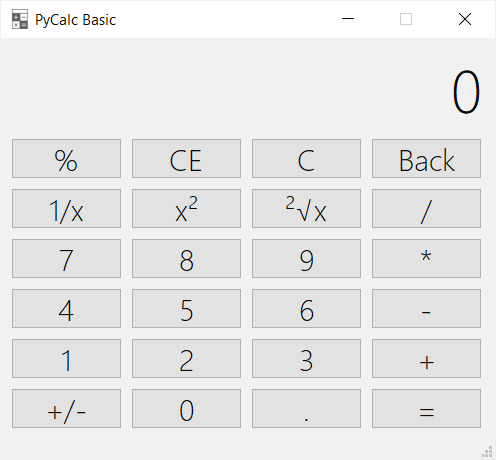

# PyCalc - basic calculator 🧮

Support open source software and help me in further development 😃
## Features 📝
- calculating simple expressions
- mathematical functions (percents, fractions, exponentiation, square root)
- built-in memory of operations  

## How it's made ❔
PyCalc is written in Python with PyQt5 module. 
## Running ⚙️
PyCalc requires PyQt5 module for running from main.py. 
You can install proper version with pip using requirements.txt.  
However, you can use .exe file and skip installing needed dependencies. 
## Using ▶️

- calculating entire expressions: 
If you want you can write something like 10*10+2/3 in expression field. 
It can be calculated easily by clicking '=' button. 
Moreover it supports Python known operations like ** (exponentation), +- (minus), -- (plus), // (integer division). 
Just try various combinations with specific symbols.
- percents: 
For now you can only use percents to calculate past number, 
e.g. 30 + 10% = 30 + (0.1 * 30) = 30 + 3 
- clear entry (CE):
You can use it to come back to past result in history of operations 
- clear (C):
Clears expression field and entire history of operations
- Back:
Removes one character from expression field 
- 1/x: 
If number in expression field, returns fraction 1/number
- x²:
If number in expression field, returns second degree's power of number 
- ²√x:
If number in expression field, returns root of number 
- +/-:
Changes positive number to negative and the second way
